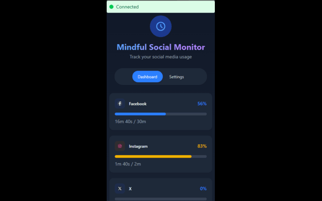
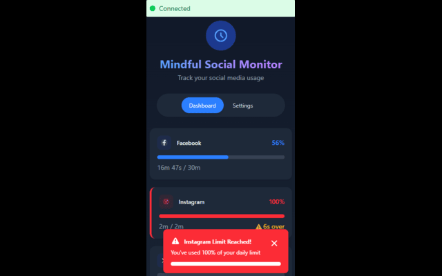
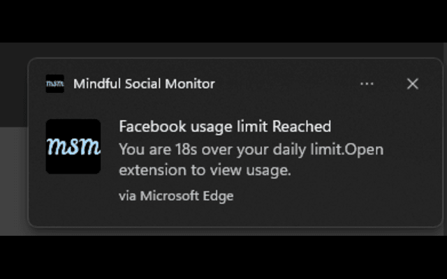

# 🌐 Mindful Social Monitor

Take control of your browsing time

---

## 🧠 What is This Extension?

**Mindful Social Monitor** is a simple and powerful browser extension designed to help you stay focused and in control of your time online.

Whether you're working, studying, or simply trying to limit distractions, this extension helps you set time limits for the social media websites you visit.

---

## ✨ What It Does

✅ **Set time limits** for websites — choose how long you're allowed to spend on sites like YouTube, Twitter, TikTok, Instagram, and Facebook.

✅ **Auto-block access** after your limit is reached — the user is notified via a notification.

✅ **Custom settings per site** — Every site can have its own timer.

✅ **Saves your preferences** — all your settings are stored locally in your browser.

✅ **Lightweight and private** — we don’t track anything or send your data anywhere.

---

## 🔒 Your Privacy Matters

This extension **does not collect or share any of your personal information**. Everything is stored privately in your browser.

---
## 📸 Screenshots

Below are some screenshots to help you see how it works:

### 🔹 Popup Interface  

### 🔹 Time Limit Settings  

### 🔹 Limit Reached (Notification)  

Thank you for using Mindful Social Monitor! We hope it helps you take back your time.
